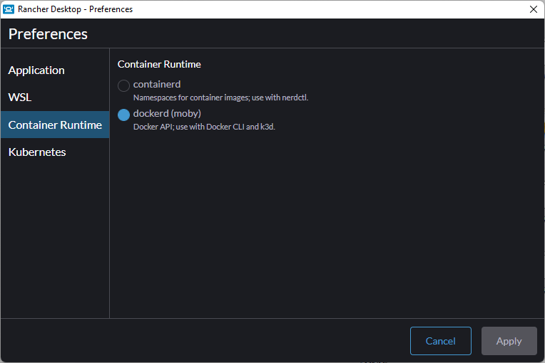
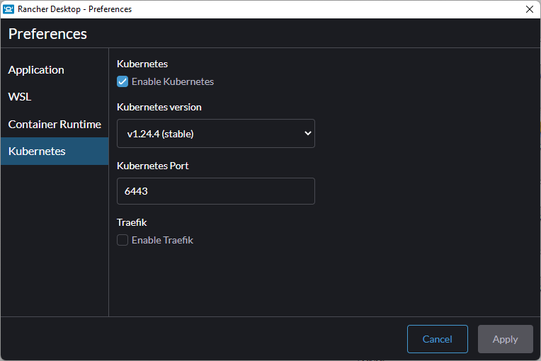
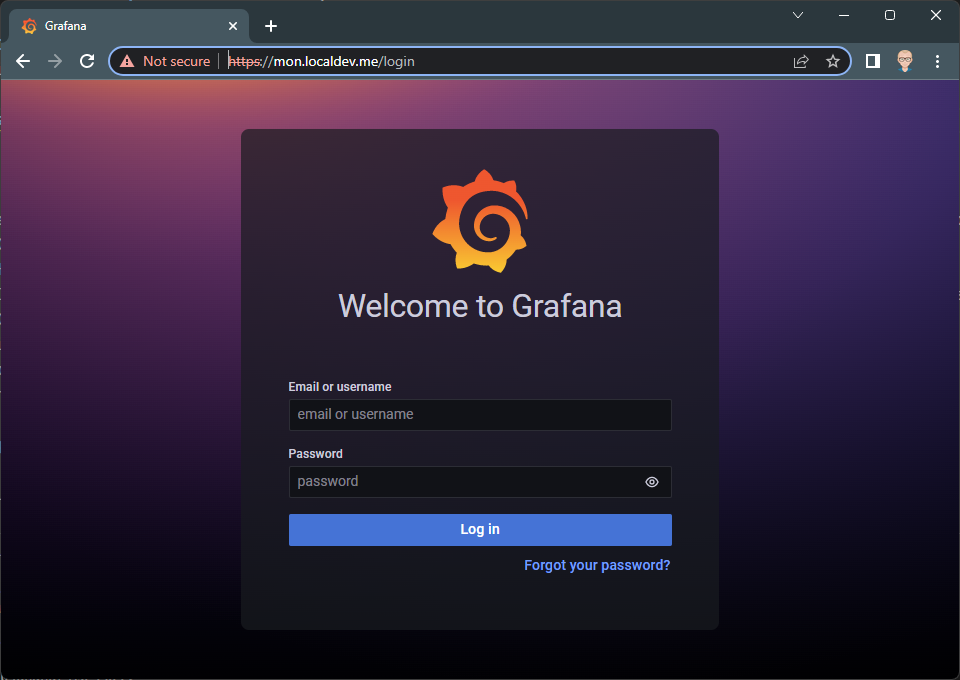
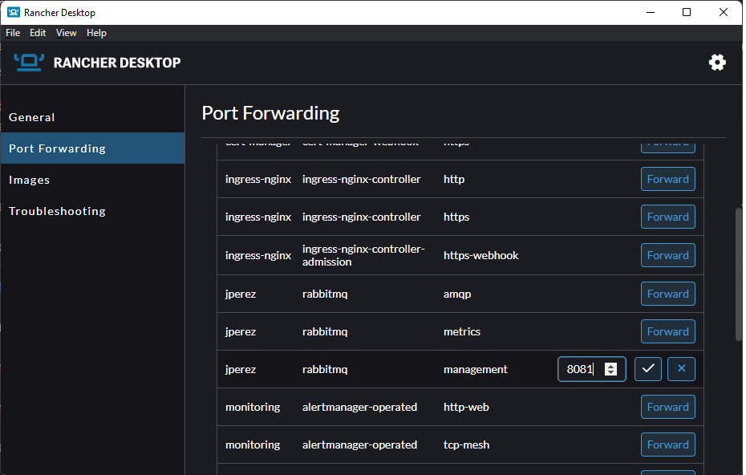
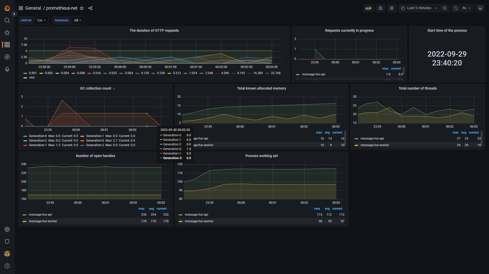
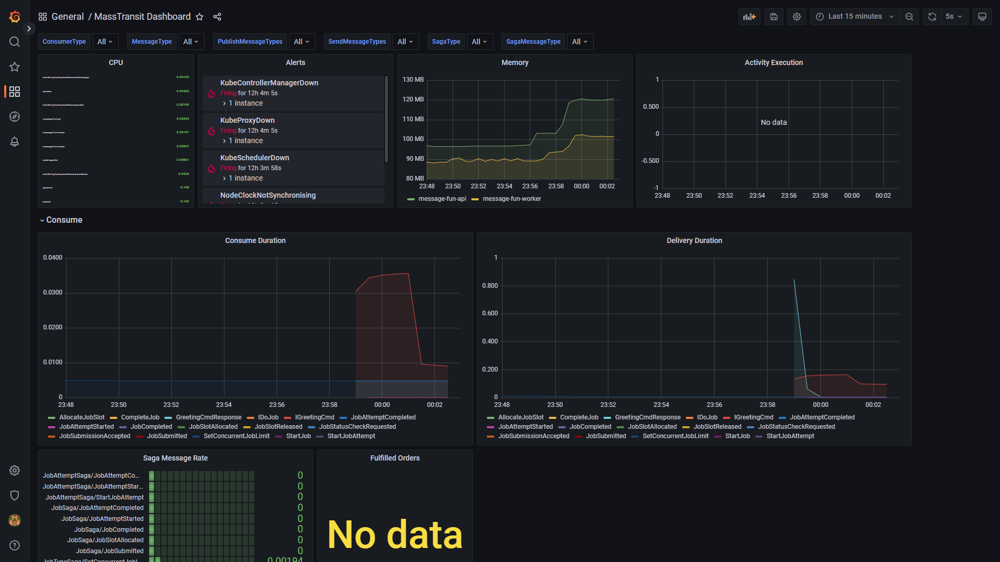

# TRABAJO PRACTICO ARQUITECTURA DE SOFTWARE II

Trabajo practico sobre contenedores y micro-servicios de ARQUTECTURA DE SOFTWARE 2 @ UNAHUR.

El trabajo practico tiene 3 puntos, descriptos en la sección [Objetivos](#objetivos), pero todos persiguen el mismo fin:

**IMPLEMENTAR EN KUBERNETES (K8S) LAS SOLUCION <https://github.com/ARQSW2/tp-containers> QUE SE ENCUENTRA IMPLEMENTANDA UTILIZANDO DOCKER-COMPOSE**

En este repositorio ya se encuentra migrado el componente `RabbitMQ` que puede usar de guía. También hay un diagrama **PARCIAL** que puede usar de base. Puede editarlo utilizando [draw.io](https://draw.io)  (la versión desktop es instalada en la sección [Heramientas](#herramientas)).

## Diagrama docker-compose


## Diagrama parcial en k8s


## Herramientas

- Rancher Desktop (obligatorio)
- Chocolatey (para Windows): Facilita la instalación de software en Windows utilizando un Package Manager como `apt-get`
- `choco install make marktext drawio -Y` POWERSHELL EN MODO ADMINISTRADOR
  - MAKE: Permite ejecutar archivos make en Windows
  - MARKTEXT: Editor de texto markdown
  - DRAW.IO: Editor de diagramas (puede usar la versión on-line si lo desea)

## Clúster de destino

El clúster de prueba es un **Rancher Desktop** con la siguiente configuración





**Inicializar el clúster**

**IMPORTANTE: ANTES DE INICIALIZAR EL CLUSTER VERIFIQUE QUE traefik este deshabilitado!!!!!!**

Para inicializar el clister ejecute el comando `make init-k8-cluster` en el directorio raíz de este repositorio.

Ese comando hará lo siguiente

- Instalar **NGINX Ingress Controller** + **Cert Manager** + **SELF SIGNED CLUSTER ISSUER**
- Instalar **kube-prometheus** encargado del monitoreo

**VERIFICACION :** espere unos dos minutos (esto puede variar de acuerdo a la capacidad de la PC) e ingrese a <http://mon.localdev.me/> debería ver la siguiente pantalla:



---

**CREDENCIALES GRAFANA:** usuario `admin` pass `prom-operator`

---

Si no funciona verifique

1. Que **traefik **este deshabilitado en las preferencias de RancherDesktop. Si **traefik** no estaba deshabilitado debe:
   - Deshabilitarlo (Preferencias de RancherDesktop)
   - Hacer un reset de kubernetes  (Troubleshooting de RancherDesktop)
   - Inicializar el clúster nuevamente ejecutando el comando `make init-k8-cluster` (en la misma carpeta donde se encuentra `Makefile`)
2. Reinicie la PC
3. Inicie Rancher Desktop
4. Espere unos 10 minutos (puede ser menos tiempo )
5. Verifique nuevamente

## Requisitos de entrega

- Utilizar este repositorio como base y respete la estructura de directorios
  
  - `./docs` imágenes y diagrama/s de la solución
  - `./resources` Archivo/s `yaml` de inicialización del clúster (que usa `Makefile`)
  - `./src` Archivo/s `yaml` con la solución propuesta
  - `./README.md` instructivo de implementación
  - `Makefile` con los scripts para inicializar el clúster y aplicación

- Generar un repositorio **PRIVADO** de GitHub , con permisos de colaborador para el usuario **rbrea-edu**

- Editar `./src/namespace.yaml` con el namespace con su nombre. En el ejemplo `jperez`

- Todos los recursos se deben implementar en el namespace creado previamente

- Editar `Makefile`
  
  - Edite la función `init-app:` para que los recursos se implementen en el namespace con su nombre
  
  - Agregue las líneas que considere necesarias en la función `init-app`

- Es un requisito indispensable para la entrega que la ejecución del comando `make init-app` se ejecute sin errores. PRUEBELO ANTES DE ENVIARLO

- Se verificara la rama `main` de repositorio a no ser que se indique lo contrario

## Objetivos

### 1. MINIMO REQUERIDO _(5 puntos)_

Implementar la solución https://github.com/ARQSW2/tp-containers a Kubernetes. La misma tiene un `docker-compose.yaml` y documentación que puede (y debe) usar de guía para la implementación en Kubernetes con los siguientes requerimientos :

- Reserva y Limite de recursos (escalamiento vertical)
- Detección de Fallos
- Posibilidad de escalar Horizontalmente
- Configuración Utilizando *ConfigMaps *y *Secrets* .
- Los servicios deben ser de tipo ClusterIp
- Diagrama de la solución (hay un diagrama de ejemplo conexionado con app.diagrams.net  )

---

**IMPORTANTE:** Este repositorio base ya contiene la implementación del componente RabbitMQ, con **TODOS  LOS OBJETIVOS**.

---

---

**IMPORTANTE:** El profesor puede realizar preguntas sobre el la solución implementada a fin de despejar dudar y/o complementar la nota del TP.

---

VERIFICACION:

1. Hacer Forward del servicio de API a una dirección en localhost. Ejemplo: Exponer el servicio `rabbitmq` puerto `management` (15672) en <http://localhost:8081>
   
   ```bash
   kubectl port-forward service/rabbitmq 8081:15672 -n jperez
   ```
   
   O desde Rancher desktop
   
   

2. Acceder a la dirección asignada en el paso anterior subpath `/swagger`.

3. Ejecutar los endpoints con resultado `HTTP STATUS 200`

### 2. INGRESS + HTTPS 2 _(3 puntos)_

Exponer los servicios necesarios vía ingress y HTTPS

- Exponer la API REST en `https://api.<<nombre de namespace>>.localdev.me/api`

- Exponer la interface Swagger en `https://api.<<nombre de namespace>>.localdev.me/swagger`

- Los endpoints de métricas NO DEBEN ESTAR EXPUESTOS

**VERIFICACION:**

1. Acceder a `https://api.<<nombre de namespace>>.localdev.me/swagger`
2. ejecutar los *endpoints* con resultado `HTTP STATUS 200`

### 3. MONITOREO _(2 puntos)_

Conectar los *endpoint* de monitoreo al sistema de monitoreo del clúster utilizando el CRD `ServiceMonitor` y verificar utilizando la intancia de grafana de monitoreo en https://mon.localdev.me usuario `admin` clave `prom-operator`.

Se han designado dos dashboards que muestran información extraída de los endpoints de monitoreo de API y WORKER

- General/ prometheus-net : muestra información general sobre el comportamiento del servicio y request http
  
  

- General/ MassTransit Dashboard: muestra información general sobre el procesamiento de tareas y mensajes dentro del contenedor
  
  
